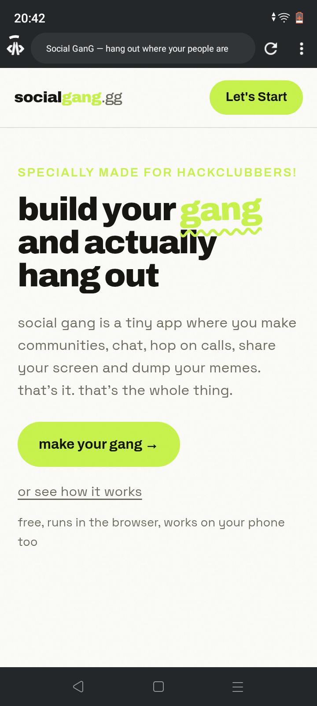
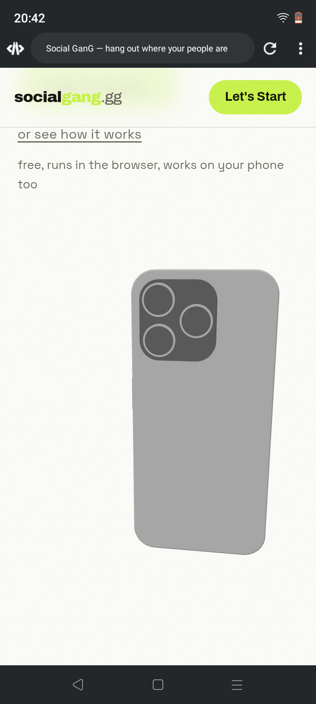

# What's this?
<ul>
  <li>This is a social media platform</li>
  <li>Specially made for hackclubbers</li>
  <li>People can post,like,and chat with each other</li>
  <li>Wanna be social ? join <strong>Social GanG</strong></li>
</ul>

# Social GanG features
<ul>
  <li>People can hangout :)</li>
  <li>Post, Chat and or Develop together</li>  
  <li><strong>Orpheus Cant haiku your messages here :></strong></li>
  <li>Much much more more</li>
</ul>

# Why i built this ?
<ul>
  <li>Because my wish -_-</li>
  <li>I wanna learn web development much much more more.</li>  
  <li>It will strong my Github portfolio</li>
  <li>I wanna learn backend and database stuff and some real world development knowledge :)</li>
</ul>

# Previews `:]`
<ul>
  <li>
    
  </li>
  <li>
    <li>
      
    </li>
  
<strong>3d mobile model was made by yutish3 on da slack thx to him :)</strong>

</ul>

# AI usage
AI was used for creating and editing the video played on that 3d mobile model.
Also used for some tests and stuff.
No more than 30% of usage.